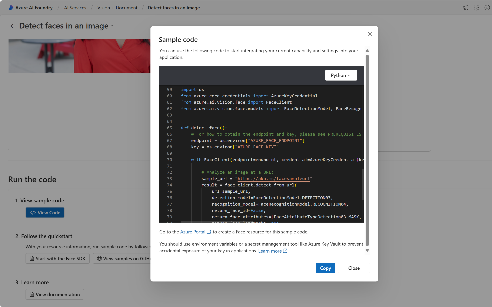

---
lab:
  title: Esplorare i servizi di intelligenza artificiale di Azure
---

# Esplorare i servizi di intelligenza artificiale di Azure

I Servizi di Azure AI consentono agli utenti di creare applicazioni di intelligenza artificiale con API e modelli pronti all'uso, predefiniti e personalizzabili. In questo esercizio, verrà creata una risorsa nel portale di Azure e verranno testati i Servizi di Azure AI. L'obiettivo di questo esercizio è avere un'idea generale di come viene effettuato il provisioning dei Servizi di Azure AI e di come vengono usati.

## Creare una risorsa dei *Servizi di Azure AI* nel portale di Azure

1. In una scheda del browser, aprire il portale di Azure all'indirizzo [https://portal.azure.com](https://portal.azure.com?azure-portal=true) e accedere usando l'account Microsoft associato alla sottoscrizione di Azure.

1. Fare clic sul pulsante **&#65291;Crea una risorsa** e cercare *Servizi di Azure Ai*. Selezionare **Crea** un piano di **Servizi di Azure AI**. Verrà visualizzata una pagina per creare una risorsa Servizi di Azure AI. Eseguire la configurazione con le seguenti impostazioni:
    - **Sottoscrizione**: *la sottoscrizione di Azure usata*.
    - **Gruppo di risorse**: *selezionare o creare un nuovo gruppo di risorse con un nome univoco*.
    - **Area**: *selezionare l'area geografica più vicina. Se negli Stati Uniti orientali usare "Stati Uniti orientali 2"*.
    - **Nome**: *immettere un nome univoco*.
    - **Piano tariffario**: *Standard S0.*
    - **Selezionando questa casella, confermo di aver letto e compreso tutte le condizioni seguenti**: *Opzione selezionata*.

1. Selezionare **Rivedi e crea**, quindi **Crea** e attendere il completamento della distribuzione.

    *Congratulazioni! È stata appena creata una risorsa Servizi di Azure AI o ne è stato effettuato il provisioning. Quella di cui è stato effettuato il provisioning in particolare è una risorsa multiservizio.*

1. Una volta completata la distribuzione, selezionare *Vai alla risorsa*. 

## Controllare le chiavi e l'endpoint

Per incorporare i servizi di Azure AI nelle applicazioni, gli sviluppatori devono disporre di una chiave di servizio e di un endpoint. Le chiavi e l'endpoint usati per lo sviluppo dell'applicazione sono disponibili nel portale di Azure. 

1. Nel portale di Azure, selezionare la risorsa. Nel menu di sinistra, alla voce *Gestione risorse*, cercare *Chiavi ed endpoint*. Selezionare **Chiavi ed endpoint** per visualizzare l'endpoint e le chiavi della risorsa. 

## Vedere i Servizi di Azure AI in azione

Per iniziare, creare un progetto Fonderia Azure AI.

1. In un Web browser, aprire il [Portale Fonderia Azure AI](https://ai.azure.com) su `https://ai.azure.com` e accedere usando le credenziali di Azure. Chiudere eventuali suggerimenti o riquadri di avvio rapido che vengono aperti al primo accesso.
 
1. In una nuova finestra del browser, aprire la [pagina di esplorazione dei servizi di Azure AI](https://ai.azure.com/explore/aiservices).

1. Nella pagina *Servizi di intelligenza artificiale* selezionare il riquadro *Visione e documento* per provare le funzionalità Visione e documento di Azure AI.

    

1. In *Visualizza tutte le funzionalità di Visione*, selezionare la scheda **Viso**. 

1. Selezionare il riquadro demo *Rilevare i visi in un'immagine*. 

1. Provare il servizio Viso, uno dei numerosi servizi di Azure AI. Fare clic su un'immagine ed esaminare gli attributi rilevati. 

    

1. Scorrere verso il basso fino alla sezione **Esegui il codice**. Selezionare **Visualizza codice**. Scorrere verso il basso fino alla sezione che inizia con *importa sistema operativo*. Nel codice di esempio fornito, verranno visualizzati dei segnaposto in cui inserire una chiave e un endpoint.

     

1. Se si desidera creare un'applicazione che usi i servizi di Azure AI, è possibile iniziare con il codice fornito. Sostituendo i segnaposto con la chiave e l'endpoint del servizio, l'applicazione sarà in grado di inviare richieste e ricevere risposte che sfruttano i servizi di Azure AI. Nel caso del servizio Viso, la *richiesta* consiste nell'analizzare l'immagine da parte del servizio Viso. La *risposta* è costituita dagli attributi rilevati. 

    >**Nota**: non è necessario conoscere la programmazione per completare gli esercizi di questo corso. Si proseguirà con l'esplorazione dei servizi di Azure AI in azione tramite il portale Fonderia Azure AI.  
 
## Eseguire la pulizia 

Al termine, è possibile eliminare la risorsa dei servizi di Azure AI dal portale di Azure. L'eliminazione della risorsa è un modo per ridurre i costi che si accumulano quando la risorsa è presente nella sottoscrizione. A tal fine, passare alla pagina **Panoramica** della risorsa dei servizi di Azure AI. Selezionare **Elimina** nella parte superiore della schermata.

