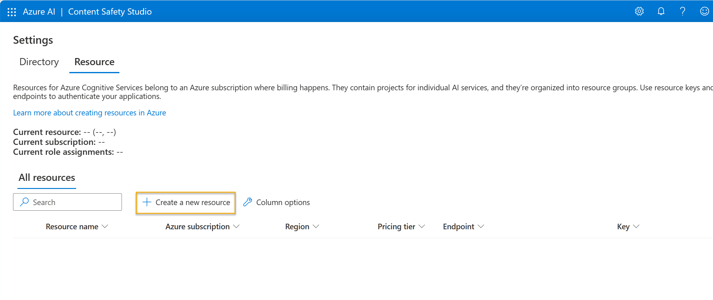

---
lab:
  title: Esplorare i servizi di intelligenza artificiale di Azure
---

# Esplorare i servizi di intelligenza artificiale di Azure

I Servizi di Azure AI consentono agli utenti di creare applicazioni di intelligenza artificiale con API e modelli pronti all'uso, predefiniti e personalizzabili. In questo esercizio si analizzerà uno dei servizi, Sicurezza dei contenuti di Azure per intelligenza artificiale, nel Content Safety Studio.

Content Safety Studio consente di esplorare il modo in cui i contenuti di testo e di immagine possono essere moderati. È possibile eseguire test su testi o immagini di esempio e ottenere un punteggio di gravità che va da sicuro a rischio elevato per ogni categoria. In questo esercizio di lab verrà creata una risorsa a servizio singolo in Content Safety Studio e ne verranno testate le funzionalità. 

> **Nota:** l'obiettivo di questo esercizio è avere un'idea generale di come viene effettuato il provisioning dei Servizi di Azure AI e di come vengono usati. Sicurezza dei contenuti è usato come esempio, ma non ci si aspetta che tramite questo esercizio si acquisisca una conoscenza completa della sicurezza dei contenuti.

## Esplorare Content Safety Studio 

1. Aprire [Content Safety Studio](https://contentsafety.cognitive.azure.com?azure-portal=true). Se non si è connessi, è necessario effettuare l'accesso. Selezionare **Accedi** in alto a destra della schermata. Per accedere, usare l'indirizzo e-mail e la password associate alla sottoscrizione di Azure. 

2. Content Safety Studio è impostato come molte altre piattaforme per i Servizi di Azure AI. Nel menu in alto, fare clic sull'icona a sinistra di *Azure AI*. Verrà visualizzato un elenco a discesa di altre piattaforme progettate per lo sviluppo con i Servizi di Azure AI. È possibile fare nuovamente clic sull'icona per nascondere l'elenco.

  

## Associare una risorsa alla piattaforma 

Prima di usare la piattaforma, è necessario associare una risorsa Servizi di Azure AI. A seconda della piattaforma, è possibile che sia necessaria una risorsa a servizio singolo specifica o che si possa usare una risorsa a più servizi generale. Nel caso di Content Safety Studio, è possibile usare il servizio creando una risorsa *Sicurezza dei contenuti* a servizio singolo o una risorsa a più servizi generale *Servizi di Azure AI*. Nei passaggi seguenti verrà creata una risorsa Sicurezza dei contenuti a servizio singolo. 

1. In alto a destra della schermata, fare clic sull'icona delle **impostazioni**. 

2. Nella pagina **Impostazioni** verranno visualizzate una scheda *Directory* e una scheda *Risorsa*. Nella scheda *Risorsa*, selezionare **Crea una nuova risorsa**. Si aprirà la pagina per creare una risorsa nel portale di Azure.

> **Nota:** la scheda *Directory* consente agli utenti di selezionare directory diverse da cui creare risorse. Non è necessario modificarne le impostazioni, a meno che non si voglia usare una directory diversa. 

3. Nella pagina *Crea sicurezza dei contenuti* nel [portale di Azure](https://portal.azure.com?azure-portal=true) è necessario configurare diversi dettagli per creare la risorsa. Eseguire la configurazione con le seguenti impostazioni:
    - **Sottoscrizione**: *la sottoscrizione di Azure usata*.
    - **Gruppo di risorse**: *selezionare o creare un nuovo gruppo di risorse con un nome univoco*.
    - **Area**: *scegliere un'area tra quelle disponibili. Se negli Stati Uniti orientali usare "Stati Uniti orientali 2"*.
    - **Nome**: *immettere un nome univoco*.
    - **Piano tariffario**: gratuito F0.

4. Selezionare **Rivedi e crea** per rivedere la configurazione. Selezionare **Crea**. La schermata indicherà quando la distribuzione è stata completata. 

*Congratulazioni! È stata appena creata una risorsa Servizi di Azure AI o ne è stato effettuato il provisioning. Quella di cui è stato effettuato il provisioning in particolare è una risorsa del servizio Sicurezza dei contenuti a servizio singolo.*

5. Una volta completata la distribuzione, aprire una nuova scheda e tornare a [Content Safety Studio](https://contentsafety.cognitive.azure.com?azure-portal=true). 

6. Selezionare nuovamente l'icona delle **impostazioni** in alto a destra della schermata. La risorsa appena creata dovrebbe essere stata aggiunta all'elenco.  

  
    
<b>Risoluzione dei problemi</b>: autorizzazioni per uno studio autogestito.

    
<b>Quando viene utilizzato un ambiente lab fornito da un istruttore, è possibile ignorare questi passaggi.</b> In caso contrario, continuare con questi passaggi.

    <ul>
        <li>Selezionare <b>Visualizza tutte le proprietà nel portale di Azure</b> nella parte inferiore della schermata *Impostazioni*.</li>
        <li>Nel portale di Azure selezionare la risorsa <em>Content Safety</em> appena creata. Nel riquadro a sinistra selezionare quindi <b>Controllo di accesso (IAM)</b>. Nel riquadro aperto selezionare quindi <b>Aggiungi</b> accanto al segno più e selezionare <b>Aggiungi assegnazione di ruolo</b>.</li>
        <li>Cercare <b>utente di servizi cognitivi</b> nell'elenco dei ruoli e selezionarlo. Quindi seleziona <b>Avanti</b>. </li>
        <li>In <b>Assegna accesso a</b> scegliere <b>Utente, gruppo o entità servizio</b>, <b>+ Seleziona membri</b>, selezionare il nome dell'utente. Lasciare vuota la descrizione.</li>
        <li>Selezionare <b>Avanti</b>. Nella pagina <b>Tipo di assegnazione</b>, selezionare il <b>Tipo di assegnazione: Attiva</b>. Selezionare <b>Durata assegnazione: Permanente</b>. Selezionare <b>Avanti</b>.</li>
        <li>Selezionare <b>Rivedi e assegna</b>, quindi <b>Rivedi e assegna</b> per aggiungere l'assegnazione di ruolo.</li>
        <li>Tornare a Content Safety Studio in https://contentsafety.cognitive.azure.com. Selezionare l'icona <b>Impostazioni</b> nella parte superiore destra della schermata. Selezionare la risorsa Sicurezza dei contenuti creata. Verificare che le <em>assegnazioni di ruolo correnti</em> includano l'<b>utente di Servizi cognitivi</b>. Potrebbe essere necessario attendere un attimo e aggiornare la pagina affinché l'assegnazione di ruolo a sia visibile.</li>
    </ul>

7. Se non è già stato fatto, selezionare la risorsa Sicurezza dei contenuti creata. 

8. Fare clic su **Usare risorsa** nella parte inferiore della schermata. Si tornerà così alla pagina iniziale della piattaforma. Ora è possibile iniziare a usare la piattaforma con la risorsa appena creata.

## Provare la moderazione testo in Content Safety Studio

1. Nella pagina iniziale di Content Safety Studio, in *Run moderation tests* (Esegui test di moderazione), passare al riquadro **Moderate text content** (Modera il contenuto del testo) e fare clic su **Try it out** (Prova).
2. In Run a simple test (Esegui un test semplice), fare clic su **Safe Content** (Contenuto sicuro). Si noti che il testo è visualizzato nel riquadro riportato di seguito. 
3. Fare clic su **Esegui test**. L'esecuzione di un test richiama il modello di Deep Learning del servizio Sicurezza dei contenuti. Il modello di Deep Learning è già stato sottoposto a training per riconoscere i contenuti non sicuri.
4. Esaminare i risultati nel pannello *Risultati*. Esistono quattro livelli di gravità, da sicuro a rischio elevato, e quattro tipi di contenuti dannosi. Il servizio di intelligenza artificiale Sicurezza dei contenuti considera questo campione accettabile? È importante notare che i risultati rientrano in un intervallo di confidenza. Un modello con training ottimale, ad esempio uno dei modelli predefiniti di Azure per intelligenza artificiale, può restituire risultati che hanno un'alta probabilità di corrispondere a ciò che un essere umano selezionerebbe. Ogni volta che si esegue un test, si richiama il modello. 
5. Provare ora con un altro campione. Selezionare il testo in Violent content with misspelling (Contenuto violento con errori di ortografia). Verificare che il contenuto sia visualizzato nel riquadro sottostante.
6. Fare clic su **Esegui test** ed esaminare di nuovo i risultati nel pannello Risultati. 

È possibile eseguire test su tutti i campioni forniti, quindi esaminare i risultati.

## Controllare le chiavi e l'endpoint

Le funzionalità testate possono essere programmate in tutti i tipi di applicazioni. Le chiavi e l'endpoint usati per lo sviluppo di applicazioni sono disponibili sia in Content Safety Studio che nel portale di Azure. 

1. In Content Safety Studio, tornare alla pagina **Impostazioni**, selezionando la scheda *Risorse*. Cercare la risorsa usata. Scorrere per visualizzare l'endpoint e la chiave della risorsa. 
2. Nel portale di Azure, si noterà che si tratta dello *stesso* endpoint e di chiavi *diverse* per la risorsa. Per verificarlo, accedere al [portale di Azure](https://portal.azure.com?auzre-portal=true). Cercare *Sicurezza dei contenuti* nella barra di ricerca superiore. Cercare la propria risorsa e fare clic su di essa. Nel menu di sinistra, alla voce *Gestione risorse*, cercare *Chiavi ed endpoint*. Selezionare **Chiavi ed endpoint** per visualizzare l'endpoint e le chiavi della risorsa. 

Al termine, è possibile eliminare la risorsa Sicurezza dei contenuti dal portale di Azure. L'eliminazione della risorsa è un modo per ridurre i costi che si accumulano quando la risorsa è presente nella sottoscrizione. A tal fine, passare alla **pagina di panoramica** della risorsa Sicurezza dei contenuti. Selezionare **Elimina** nella parte superiore della schermata.

