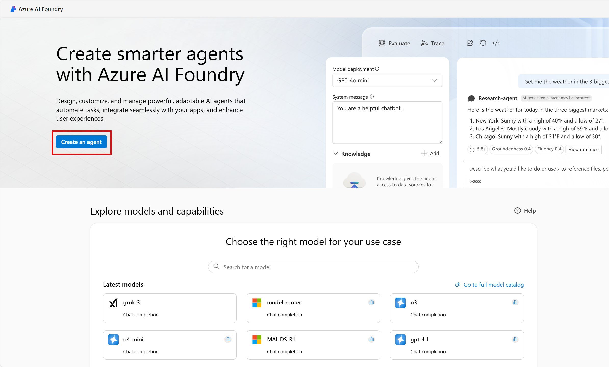

---
lab:
  title: Esplorare la sicurezza dei contenuti in Fonderia Azure AI
---

# Esplorare la sicurezza dei contenuti in Fonderia Azure AI

I Servizi di Azure AI consentono agli utenti di creare applicazioni di intelligenza artificiale con API e modelli pronti all'uso, predefiniti e personalizzabili. In questo esercizio verrà esaminato uno dei servizi, Sicurezza dei contenuti di Azure AI, che consente di moderare il testo e il contenuto delle immagini. Nel portale Fonderia Azure AI, la piattaforma Microsoft per la creazione di applicazioni intelligenti, verrà utilizzato Sicurezza dei contenuti di Azure AI per classificare il testo e assegnargli il punteggio di gravità. 

> **Nota:** l'obiettivo di questo esercizio è avere un'idea generale di come viene effettuato il provisioning dei Servizi di Azure AI e di come vengono usati. Sicurezza dei contenuti è usato come esempio, ma non ci si aspetta che tramite questo esercizio si acquisisca una conoscenza completa della sicurezza dei contenuti.

## Creare un progetto nel portale Fonderia Azure AI

1. In una scheda del browser passare al [portale Fonderia Azure AI](https://ai.azure.com?azure-portal=true).

2. Accedi con il tuo account. 

3. Nella home page del portale Fonderia Azure AI, selezionare **Crea un progetto**. In Fonderia Azure AI, i progetti sono contenitori che consentono di organizzare il lavoro.  

    

4. Nel riquadro *Crea un progetto* verrà visualizzato un nome di progetto generato, che è possibile mantenere così com'è. A seconda che in passato sia stato creato un hub, verrà visualizzato un elenco di *nuove* risorse di Azure da creare o un elenco a discesa di hub esistenti. Se viene visualizzato l'elenco a discesa degli hub esistenti, selezionare *Crea nuovo hub*, creare un nome univoco per l'hub e selezionare *Avanti*.  
 
    

> **Importante**: per completare il resto del lab, è necessario eseguire il provisioning di una risorsa Servizi di Azure AI in una posizione specifica.

5. Nello stesso riquadro *Crea un progetto* selezionare **Personalizza** e una delle **Posizioni** seguenti: Stati Uniti orientali, Francia centrale, Corea centrale, Europa occidentale o Stati Uniti occidentali per completare il resto del lab. Quindi, selezionare **Crea**. 

1. Prendere nota delle risorse create: 
- Servizi di Azure AI
- Hub di Azure per intelligenza artificiale
- Progetto Azure per intelligenza artificiale
- Account di archiviazione
- Key vault
- Gruppo di risorse  

6. Dopo aver creato le risorse, verrà visualizzata la pagina *Panoramica* del progetto. 

7. Per usare Sicurezza dei contenuti, è necessario aggiornare le autorizzazioni alla risorsa dell'*hub Azure I*. A tale scopo, aprire il [portale di Azure](https://portal.azure.com?portal-azure=true) e accedere con la stessa sottoscrizione usata per creare le risorse di Fonderia AI.  

8. Nel portale di Azure, usare la barra di ricerca in alto nella pagina per cercare e selezionare **Fonderia Azure AI**. Nella pagina della risorsa, selezionare la risorsa appena creata che è il *tipo* di **hub di Azure AI**.  

9. Nel portale di Azure, nel riquadro a sinistra selezionare **Controllo di accesso (IAM)**. Nel riquadro aperto selezionare quindi **Aggiungi** accanto al segno più e selezionare **Aggiungi assegnazione di ruolo**. 

10. Cercare il **Valutatore di sicurezza di Azure AI** nell'elenco dei ruoli e selezionarlo. Quindi seleziona **Avanti**. 

11. Usare le impostazioni seguenti per assegnare se stessi al ruolo: 
    - **Assegnare l'accesso a**: selezionare *utente, gruppo o entità servizio*
    - **Membri**: fare clic su *selezionare membri*
        - Nel riquadro aperto *Selezionare i membri*, trovare il proprio nome. Fare clic sull'icona con il segno più accanto al nome. Fare clic su **Seleziona**.
    - **Descrizione**: *lasciare vuoto*

12. Selezionare **Rivedi e assegna**, quindi selezionare di nuovo **Rivedi e assegna** per aggiungere l'assegnazione di ruolo.    

13. Nel browser tornare al [portale Fonderia Azure AI](https://ai.azure.com?azure-portal=true). Seleziona il progetto. 

14. Nel menu a sinistra nella schermata selezionare **Servizi di intelligenza artificiale**.
 
      

15. Nella pagina *Servizi di intelligenza artificiale* selezionare il riquadro *Visione e documento* per provare le funzionalità Visione e documento di Azure AI.
    
    

## Provare la moderazione testo con Sicurezza dei contenuti nel portale di Fonderia Azure AI 

1. Nella pagina *Sicurezza dei contenuti* in *Filtra il contenuto del testo*, selezionare **Modera il contenuto del testo**.

2. Nella pagina *Modera il contenuto del testo*, sotto l'intestazione *Prova*, selezionare la risorsa Servizi di Azure AI appena creata dal menu a discesa.   

3. In *Esegui un test semplice* selezionare il riquadro **Contenuto sicuro**. Si noti che il testo è visualizzato nel riquadro riportato di seguito. 

4. Fare clic su **Esegui test**. L'esecuzione di un test richiama il modello di Deep Learning del servizio Sicurezza dei contenuti. Il modello di Deep Learning è già stato sottoposto a training per riconoscere i contenuti non sicuri.

5. Esaminare i risultati nel pannello *Risultati*. Esistono quattro livelli di gravità, da sicuro a rischio elevato, e quattro tipi di contenuti dannosi. Il servizio di intelligenza artificiale Sicurezza dei contenuti considera questo campione accettabile? È importante notare che i risultati rientrano in un intervallo di confidenza. Un modello con training ottimale, ad esempio uno dei modelli predefiniti di Azure per intelligenza artificiale, può restituire risultati che hanno un'alta probabilità di corrispondere a ciò che un essere umano selezionerebbe. Ogni volta che si esegue un test, si richiama il modello. 

6. Provare ora con un altro campione. Selezionare il testo in Violent content with misspelling (Contenuto violento con errori di ortografia). Verificare che il contenuto sia visualizzato nel riquadro sottostante.

7. Fare clic su **Esegui test** ed esaminare di nuovo i risultati nel pannello Risultati. 

È possibile eseguire test su tutti i campioni forniti, quindi esaminare i risultati.

## Eliminazione

Se non si intende eseguire altri esercizi, eliminare eventuali risorse non più necessarie. In questo modo si evita di accumulare costi non necessari.

1. Aprire il [portale di Azure]( https://portal.azure.com) e selezionare il gruppo di risorse che contiene la risorsa creata.
1. Selezionare la risorsa e selezionare **Elimina**, quindi **Sì** per confermare. La risorsa viene quindi eliminata.

## Altre informazioni

Questo esercizio ha dimostrato solo alcune delle funzionalità del servizio Sicurezza dei contenuti. Per altre informazioni su cosa è possibile fare con questo servizio, consultare la [pagina di Sicurezza dei contenuti](https://learn.microsoft.com/azure/ai-services/content-safety/overview).