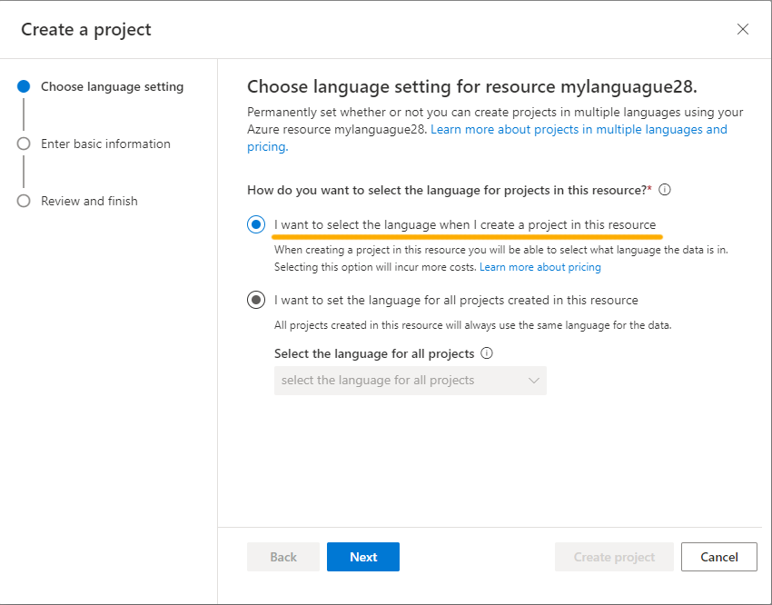
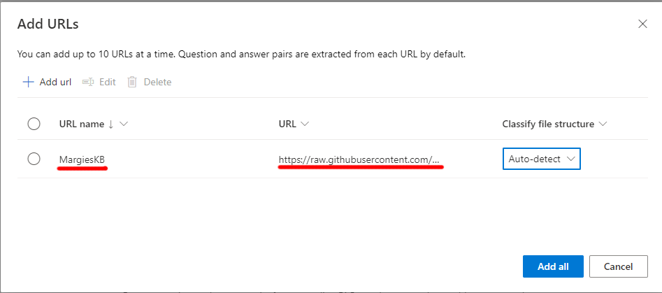

---
lab:
  title: Usare Risposta alla domanda con Language Studio
---

# Usare Risposta alla domanda con Language Studio

In questo esercizio, verrà usato Language Studio per creare ed eseguire il training di una knowledge base di domande e risposte. Il contenuto della knowledge base proviene da una pagina di domande frequenti esistente del sito Web di Margie's Travel, un'agenzia di viaggi fittizia. Si userà quindi Language Studio per vedere come funziona quando viene usato dai clienti.

Lingua di Azure AI include funzionalità di *risposta alle domande*, che verranno usate per creare una knowledge base. Le knowledge base possono essere create immettendo manualmente coppie di domande e risposte, o a partire da un documento o da una pagina Web esistente. Margie's Travel vuole usare il documento con le domande frequenti esistenti.

La funzionalità di risposta alla domanda del servizio Lingua consente di creare rapidamente una knowledge base, immettendo coppie di domande e risposte o da un documento o da una pagina Web esistente. Può quindi usare alcune capacità di elaborazione del linguaggio naturale predefinite per interpretare le domande e trovare le risposte appropriate.

## Creare una risorsa del servizio *Lingua*

Per usare Risposta alle domande, è necessaria una risorsa del servizio **Lingua**.

1. In un’altra scheda del browser aprire il portale di Azure in [https://portal.azure.com](https://portal.azure.com?azure-portal=true), accedere con l’account Microsoft associato alla sottoscrizione di Azure.

1. Cliccare sul pulsante **＋ Crea una risorsa** e cercare *Servizio Lingua*. Selezionare **Crea** un piano del **Servizio Lingua**. Verrà visualizzata una pagina dove **Selezionare funzionalità aggiuntive**. Usare le seguenti impostazioni:
    - **Seleziona funzionalità aggiuntive**:
        - **Funzionalità predefinite**: *mantenere le funzionalità predefinite*.
        - **Funzionalità personalizzate**: *selezionare Risposta personalizzata alle domande*.
     - Selezionare **Continua per creare la risorsa**
    

1. Nella pagina **Crea Lingua** specificare le impostazioni seguenti:
    - **Dettagli del progetto**
        - **Sottoscrizione**: *la sottoscrizione di Azure usata*.
        - **Gruppo di risorse**: *selezionare un gruppo di risorse esistente o crearne uno nuovo*.
    - **Dettagli dell'istanza**
        - **Area**: *Selezionare un'area. Se negli Stati Uniti orientali usare "Stati Uniti orientali 2"*      
        - **Nome**: *specificare un nome univoco per la risorsa Lingua*.
        - **Piano tariffario**: S (1.000 chiamate al minuto).
    - **Risposta personalizzata alle domande**
        - **Area di Ricerca di Azure**: *qualsiasi località disponibile*.
        - **Piano tariffario di Ricerca di Azure**: F gratuito (3 indici): *se questo piano non è disponibile, selezionare Basic*
    - **Informativa Intelligenza artificiale responsabile**
        - **Selezionando questa casella, dichiaro di conoscere e confermare tutti i termini indicati nei nostri principi di intelligenza artificiale responsabile**: *selezionata*.

1. Selezionare **Rivedi e crea** e quindi **Crea**. Attendere il completamento della distribuzione del servizio Lingua che supporterà la knowledge base della funzionalità di risposta alla domanda personalizzata.

    > **Nota:** se è già stato effettuato il provisioning della risorsa **Ricerca cognitiva di Azure** di livello gratuito, la quota potrebbe non consentire di crearne un'altra. In questo caso, selezionare un livello diverso da **Gratuito F**.

## Crea un nuovo progetto

1. In una nuova scheda del browser aprire il portale Language Studio all'indirizzo [https://language.azure.com](https://language.azure.com?azure-portal=true) e accedere usando l'account Microsoft associato alla sottoscrizione di Azure.
1. Se viene richiesto di scegliere una risorsa del servizio Lingua, selezionare le impostazioni seguenti:
    - **Directory di Azure**: *la directory di Azure contenente la sottoscrizione*.
    - **Sottoscrizione di Azure**: *La tua sottoscrizione di Azure*.
    - **Risorsa della lingua**: *La risorsa del servizio Lingua creata in precedenza.*

    Se ***non*** viene chiesto di scegliere una risorsa Lingua, è possibile che nella sottoscrizione siano presenti più risorse di questo tipo e in tal caso:
    1. Nella barra in alto della pagina selezionare **Impostazioni (&#9881;)**.      
    1. Nella pagina **Impostazioni** visualizzare la scheda **Risorse**.
    1. Selezionare la risorsa del servizio Lingua appena creata, poi selezionare **Cambia risorsa**.
    1. Nella parte superiore della pagina selezionare **Language Studio** per tornare alla home page di Language Studio.

1. Nella parte superiore del portale di Language Studio scegliere **Risposta personalizzata alle domande** dal menu **Crea nuovo**.

    

1. Nella pagina **Scegli l'impostazione della lingua per la risorsa *nome della risorsa*** selezionare **Seleziona la lingua quando si crea un progetto in questa risorsa** e fare clic su **Avanti**.
  

1. Nella pagina **Enter basic information** (Immetti informazioni di base) immettere i dati seguenti e fare clic su **Avanti**:
    - **Risorsa Lingua**: *scegliere la risorsa Lingua*.  
    - **Risorsa Ricerca di Azure**: *scegliere la risorsa Ricerca di Azure*.
    - **Nome**: `MargiesTravel`
    - **Descrizione**: `A simple knowledge base`
    - **Lingua di origine**: inglese
    - **Risposta predefinita quando non viene restituita alcuna risposta**: `No answer found`
1. Nella pagina **Rivedi e completa** selezionare **Crea progetto**.
1. Verrà visualizzata la pagina **Gestisci origini**. Selezionare **+ Aggiungi origine** poi selezionare **URL**.
1. Nella casella **Aggiungi URL** selezionare **+ Aggiungi URL**. Digitare quanto segue e selezionare **Aggiungi tutto**:
    - **Nome URL**: `MargiesKB`
    - **URL**: `https://raw.githubusercontent.com/MicrosoftLearning/mslearn-ai-fundamentals/main/data/natural-language/margies_faq.docx`
    - **Classifica struttura file**: *Rilevamento automatico*
1. Selezionare **Aggiungi tutto.**  

 

## Modificare la knowledge base

La knowledge base si basa sui dettagli nel documento delle domande frequenti e su alcune risposte predefinite. È possibile aggiungere coppie di domande e risposte personalizzate per integrare questi dati.

1. Espandere il pannello a sinistra e selezionare **Modifica knowledge base**. Selezionare quindi **+** per aggiungere una nuova coppia di domande.
1. Nella finestra di dialogo **Aggiungi una nuova coppia di domande e risposte** nel campo **Domanda** digitare `Hello` e nel campo **Risposta** digitare `Hi`, poi selezionare **Fine**.
1. Espandere **Domande alternative** e selezionare **+ Aggiungi domanda alternativa**. Immettere quindi `Hiya` come formulazione alternativa di "Hello".
1. Nella parte superiore del riquadro **Coppie di domande e risposte** selezionare **Salva** per salvare la knowledge base.

## Eseguire il training e il test della knowledge base

Ora che è stata creata una knowledge base, è possibile testarla.

1. Nella parte superiore del riquadro **Coppie di domande e risposte** selezionare **Test** per testare la knowledge base.
1. Nella parte inferiore del riquadro di test immettere il messaggio `Hi`. Dovrebbe essere restituita la risposta *Hi*.
1. Nella parte inferiore del riquadro di test immettere il messaggio `I want to book a flight`. Dovrebbe essere restituita una risposta appropriata dalle domande frequenti.

    > **Nota:** la risposta include una *risposta breve* oltre a un *passaggio di risposta* più dettagliato: il passaggio di risposta mostra il testo completo nel documento delle domande frequenti per la domanda più simile, mentre la risposta breve viene estratta in modo intelligente dal passaggio. È possibile controllare se la risposta breve proviene dalla risposta usando la casella di controllo **Visualizza risposta breve** nella parte superiore del riquadro di test.

1. Provare con un'altra domanda, ad esempio `How can I cancel a reservation?`
1. Una volta terminato il test della knowledge base, selezionare **Test** per chiudere il riquadro di test.

## Distribuire il progetto

È possibile distribuire la Knowledge base come applicazione client per rispondere alle domande.

1. Nel pannello a sinistra selezionare **Distribuisci knowledge base**.
1. Nella parte superiore della pagina selezionare **Distribuisci**. Una finestra di dialogo chiederà se si vuole distribuire il progetto. Seleziona **Distribuisci**.

 

## Eseguire la pulizia

Se non si intende eseguire altri esercizi, eliminare eventuali risorse non più necessarie. In questo modo si evita di accumulare costi non necessari.

1. Aprire il [portale di Azure]( https://portal.azure.com) e selezionare il gruppo di risorse che contiene la risorsa creata. 
1. Selezionare la risorsa e selezionare **Elimina**, quindi **Sì** per confermare. La risorsa viene quindi eliminata.

## Altre informazioni

- Per altre informazioni sul servizio di risposta alla domanda, vedere la [documentazione](https://docs.microsoft.com/azure/cognitive-services/language-service/question-answering/overview).
