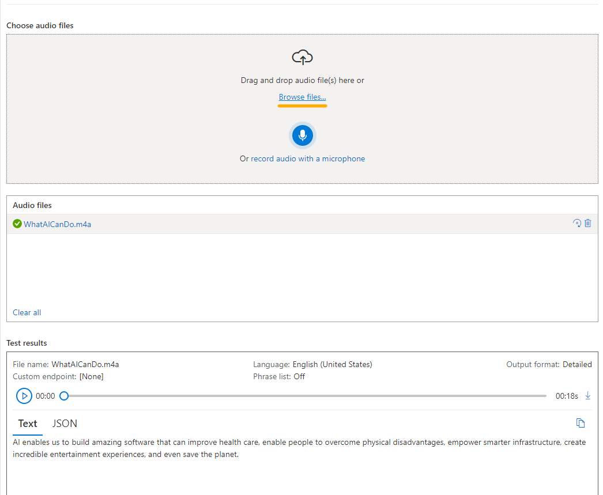

---
lab:
  title: Esplorare Speech Studio
---

# Esplorare Speech Studio

Il **servizio Voce** di Intelligenza artificiale di Azure trascrive il parlato in testo e testo in voce udibile. È possibile usare Il riconoscimento vocale di intelligenza artificiale per creare un'applicazione in grado di trascrivere le note della riunione o generare testo dalla registrazione dei colloqui.

In questo esercizio si proveranno le funzionalità di Riconoscimento vocale di Intelligenza artificiale di Azure usando Azure AI Speech Studio. 

## Creare una *risorsa voce* di Intelligenza artificiale di Azure

È possibile usare il servizio Voce creando una risorsa **Voce** o una risorsa **Servizi di Azure AI**.

In questo esercizio si creerà una risorsa voce di intelligenza artificiale, a meno che non si disponga già di una risorsa che è possibile usare.

1. In un'altra scheda del browser aprire [Azure AI Speech Studio](https://speech.microsoft.com/), accedere con l'account Microsoft.

1. Selezionare **Impostazioni** quindi **Crea una risorsa.** Eseguire la configurazione con le seguenti impostazioni:
    - **Nome della nuova risorsa: *immettere un nome* univoco**.
    - **Sottoscrizione**: *la sottoscrizione di Azure usata*.
    - **Area**: *selezionare un'area * supportata.
    - **** Piano tariffario: *fo gratuito (se disponibile, altrimenti selezionare Standard S0).*
    - **Gruppo di risorse**: *selezionare o creare un nuovo gruppo di risorse con un nome univoco*.
1. Selezionare **Crea risorsa**. Attendere che la risorsa sia stata creata e quindi selezionare **Usa risorsa**. Viene visualizzata la pagina Introduzione al riconoscimento vocale.

## Esplorare il riconoscimento vocale in Speech Studio

1. Selezionare questa opzione [**https://aka.ms/mslearn-speech-files](https://aka.ms/mslearn-speech-files)** per scaricare **speech.zip.** Apri la cartella . 

1. Nella pagina Introduzione al riconoscimento vocale, in *Riconoscimento vocale* trovare *sintesi vocale* in tempo reale. Selezionare **Prova riconoscimento vocale in tempo reale per il testo**.

    

1. In *Scegli file* audio selezionare **Sfoglia file** e passare alla cartella in cui è stato salvato il file. Selezionare **WhatAICanDo.m4a** e quindi **Apri**.

    

1. Il servizio Voce trascrive e visualizza il testo in tempo reale. Se hai audio sul tuo computer, puoi ascoltare la registrazione mentre il testo viene trascritto.
1. Esaminare l'output, che dovrebbe essere stato riconosciuto e trascritto correttamente l'audio in testo.

    > **Nota** Se viene visualizzato un messaggio di errore, attendere alcuni minuti prima di riprovare. La risorsa Voce per il primo uso richiede un po' di tempo.

In questo esercizio è stata creata una risorsa voce di intelligenza artificiale in Speech Studio. È stato quindi usato il servizio di sintesi vocale in tempo reale per trascrivere una registrazione audio. È stato possibile visualizzare la trascrizione del testo generata durante la riproduzione del file audio.

## Eseguire la pulizia

Se non si intende eseguire altri esercizi, eliminare le risorse non più necessarie. In questo modo si evita di accumulare costi non necessari.

1. Aprire il [portale di Azure]( https://portal.azure.com) e selezionare il gruppo di risorse contenente la risorsa creata.
1. Selezionare la risorsa e selezionare **Elimina** e quindi **Sì** per confermare. La risorsa viene quindi eliminata.

## Altre informazioni

Questo esercizio ha dimostrato solo alcune delle funzionalità del servizio Voce. Per altre informazioni su cosa è possibile fare con questo servizio, vedere la [pagina del servizio Voce](https://azure.microsoft.com/services/cognitive-services/speech-services).
