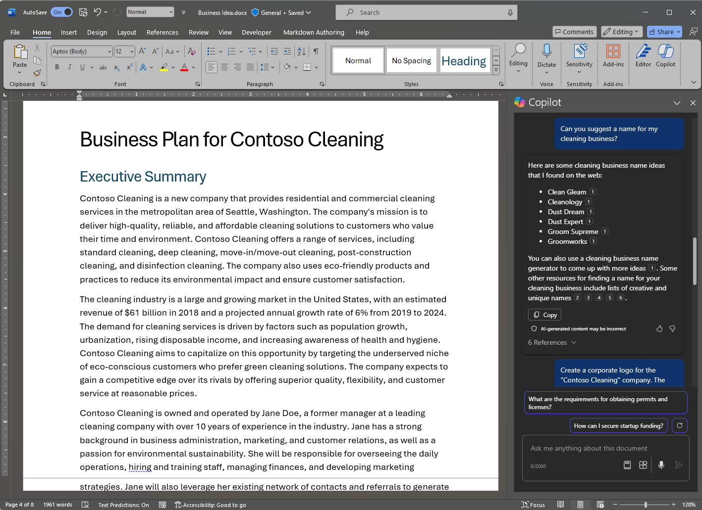
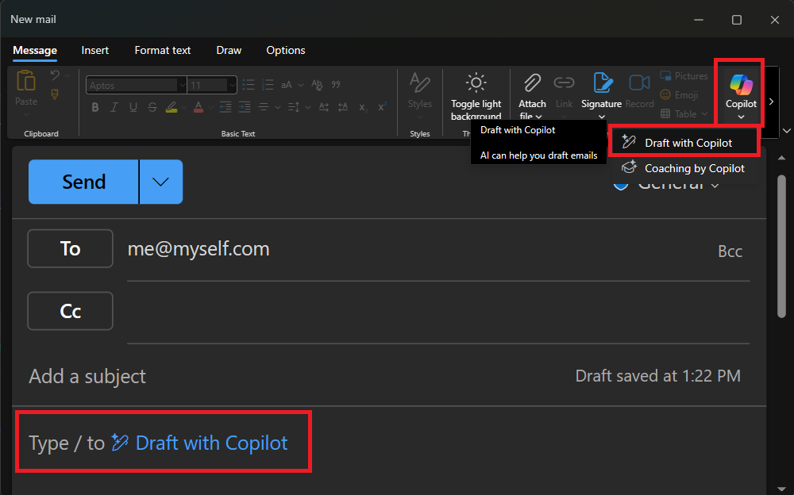

---
lab:
  title: Esplorare Copilot per Microsoft 365
---
# Esplorare Copilot per Microsoft 365

In questo esercizio si esamineranno alcuni dei modi in cui Microsoft Copilot può usare l'intelligenza artificiale generativa per migliorare la produttività durante la creazione di nuovi contenuti. Nello scenario di questo esercizio, si inizierà con alcune note di alto livello alla base di un'idea di business e si userà Copilot per Microsoft 365 in più app, ad esempio Word, PowerPoint ed Excel per sviluppare un piano aziendale e una presentazione per potenziali investitori.

Il completamento di questo esercizio richiede circa **40** minuti.

> **Nota**: Questo esercizio richiede una licenza di **Copilot per Microsoft 365** dell'organizzazione.

## Usare Copilot per esplorare un documento e fare ricerca per un'idea

Per iniziare l'esplorazione dell'intelligenza artificiale generativa, si userà Copilot per Word per esaminare un documento esistente ed estrarre alcune informazioni dettagliate.

1. Nella scheda del browser, aprire il documento [Business Idea.docx](https://github.com/MicrosoftLearning/mslearn-ai-fundamentals/raw/main/data/generative-ai/Business%20Idea.docx) in `https://github.com/MicrosoftLearning/mslearn-ai-fundamentals/raw/main/data/generative-ai/Business%20Idea.docx`. 
1. Selezionare **Scarica** per salvare il file nella cartella **Download** del PC.
1. **Spostare** o **Copiare e incollare** il documento appena scaricato nella cartella di **OneDrive**.
1. Dalla cartella di **OneDrive**, aprire **Business Idea.docx** in Microsoft Word (chiudendo eventuali messaggi di benvenuto o notifiche di nuove funzionalità) ed esaminare il documento, che descrive alcune idee di alto livello per un'attività di pulizia a New York City. Se richiesto, selezionare **Abilita modifica** nella parte superiore.
1. Individuare e selezionare l'icona **Copilot** sulla barra degli strumenti di Word per aprire il riquadro Copilot, come illustrato di seguito (il tema visualizzato può variare):

    

1. Immettere la richiesta seguente nell'area di testo nella parte inferiore del riquadro Copilot:

    ```
    What is this document about?
    ```

1. Esaminare la risposta di Copilot, che dovrebbe riepilogare i punti principali del documento, come illustrato di seguito:

    

    > La risposta specifica ricevuta può variare in base alla natura dell'IA generativa.

1. Tornare al riquadro Copilot per porre a Copilot la domanda seguente:

    ```
    How do I setup a new business in New York?
    ```

1. Esaminare la risposta e continuare con domande aggiuntive in base alle esigenze. Quando si è soddisfatti della risposta, usare l'icona **Copia** (&#128461;) sotto la risposta per copiarla negli Appunti. Incollarlo nel documento di Word, selezionare tutto il testo, quindi selezionare l'icona Copilot (nella parte inferiore del testo selezionato) per visualizzare il testo come tabella.

    

1. Esaminare la tabella e chiedere a Copilot di aggiungere altre informazioni, ad esempio i riferimenti ad altri dettagli.  La risposta dovrebbe essere simile alla seguente (potrebbe essere necessario usare il pulsante **Rigenera**):

    

    > **Importante**: La risposta generata dall'intelligenza artificiale si basa su informazioni pubbliche sul Web. Anche se può essere utile per aiutare a comprendere i passaggi necessari per creare un'azienda, non è garantito che sia accurato al 100% e non sostituisce la necessità di consigli professionali!

1. Quando si è soddisfatti della tabella generata da Copilot, selezionare l'opzione per **Mantenerla**.

## Usare Copilot per creare contenuti per un piano aziendale

Ora che hai fatto alcune ricerche iniziali, Copilot ti aiuterà a sviluppare un piano aziendale per la tua impresa di pulizie.

1. Con il documento **Business Idea.docx** ancora aperto, nel riquadro Copilot, immettere la richiesta seguente:

    ```
    Can you suggest a name for my cleaning business?
    ```

1. Esaminare i suggerimenti e selezionare un nome per l'impresa di pulizie (o continuare a chiedere di trovare un nome desiderato).
1. Nel documento di Word selezionare l'icona Copilot nel margine per creare nuovi contenuti. Immettere il prompt seguente, sostituendo **Contoso Cleaning** con il nome della società desiderato:

    ```
    Write a business plan for "Contoso Cleaning" based on the information in this document. Include an executive summary, market overview, and financial projections.
    ```

    

1. Esaminare la risposta creata da Copilot e mantenerla, aggiustare il tono, la lunghezza o chiedere a Copilot di riscriverla tramite una nuova richiesta. Applicare intestazioni e stili appropriati al documento per renderlo professionale. La risposta è simile alla seguente:

    

1. Se le proiezioni finanziarie nel piano aziendale non sono formattate come tabella, selezionarle e usare Copilot per visualizzare le proiezioni come tabella.
1. Selezionare la tabella delle proiezioni finanziarie e copiarla negli Appunti.
1. Salvare il documento di Word, quindi chiuderlo.

## Visualizzare le proiezioni finanziarie in Copilot per Excel

Con un piano aziendale disponibile, possiamo prendere alcuni di questi dati sulle proiezioni finanziarie e chiedere a Copilot in Excel di visualizzare i dati in modo automatico, in modo da poterli includere in messaggi di posta elettronica o presentazioni per investitori.

1. Aprire **Excel** e creare una nuova cartella di lavoro vuota. Salvare immediatamente la cartella di lavoro come **Proiezioni finanziarie.xlsx** in OneDrive altrimenti Copilot non funzionerà.
1. Incollare la tabella della proiezione delle vendite da **Business Idea.docx** nel foglio di calcolo di Excel e **formattarla come tabella**. A questo scopo, è necessario:
    1. Selezionare una **cella** all'interno dei dati.
    1. Selezionare **Home** e scegliere **Formatta come tabella** in Stili. 
    1. Scegliere uno stile per la tabella.
    1. Nella finestra di dialogo **Crea tabella** confermare o impostare l'intervallo di celle.
    1. Contrassegnare se la tabella contiene intestazioni e selezionare **OK**.
1. Con le proiezioni di vendita formattate come tabella, aprire il riquadro Copilot dalla scheda **Home** della barra multifunzione di Excel e immettere il prompt seguente:

    ```
    Suggest ways to visualize these financial projections.
    ```
    
1. Copilot dovrebbe suggerire un modo per visualizzare i dati e offrire l'aggiunta di un grafico pivot a un nuovo foglio.

    

1. Aggiungere il grafico pivot a un nuovo foglio e aprirlo. Selezionare il grafico e quindi selezionare **Progettazione** per applicare gli stili, modificare il tipo di grafico e altre operazioni. Al termine, si dovrebbe ottenere un elemento simile al seguente:

    

1. Salvare la cartella di lavoro e chiudere Excel.

Sono stati appena usati i dati creati da Copilot in Word per visualizzarli in Excel. Nell'esercizio successivo si passerà all'uso di Copilot in Outlook per comporre e inviare messaggi di posta elettronica sul lavoro svolto.

## Usare Copilot per comporre un messaggio di posta elettronica

Sono stati creati alcuni elementi collaterali che consentono di iniziare a creare la propria attività. Ora è il momento di contattare un investitore alla ricerca di alcuni finanziamenti iniziali.

1. Aprire **Outlook**. Se Outlook non è stato configurato con l'account Microsoft 365, provvedere a farlo.

    > **Suggerimento**: Per assistenza, vedere [Configurare e usare Outlook - supporto tecnico Microsoft](https://support.microsoft.com/office/set-up-and-use-outlook-4636f361-d5e3-4a87-9cd4-382858de55fa).

1. Nella barra degli strumenti passare alla **nuova esperienza di Outlook** se non è già attiva.

    > **Nota**: Per ottenere le funzionalità di Copilot più recenti in Outlook, è consigliabile usare l'esperienza "Nuovo Outlook". Per visualizzare la versione in uso, vedere [Quale versione di Outlook è in uso? - Supporto tecnico Microsoft](https://support.microsoft.com/office/what-version-of-outlook-do-i-have-b3a9568c-edb5-42b9-9825-d48d82b2257c).

1. Creare una nuova e-mail e compilare la casella **A** con il proprio indirizzo e-mail.
1. È possibile iniziare a scrivere il messaggio di posta elettronica dal riquadro Copilot o direttamente dal corpo del messaggio di posta elettronica:

    
    
1. Immettere il prompt seguente e modificare le opzioni per impostare il tono su "Formale" e la lunghezza su "Media":

    ```
    Request a meeting with an investment bank to discuss funding for a commercial cleaning business.
    ```

    

1. Selezionare **Genera bozza** ed esaminare l'output generato. Aggiustare il tono o indicare a Copilot cosa si vuole modificare del messaggio di posta elettronica.

    

1. Se lo desideri, puoi inviare l'e-mail a te stesso.

## Usare Copilot per creare contenuto per una presentazione

Con l'aiuto di Copilot, è stata creata una bozza di un piano aziendale per l'idea del servizio di pulizia, sono state preparate alcune proiezioni finanziarie e inviato un messaggio di posta elettronica per richiedere una riunione con un potenziale investitore. A questo punto è necessaria una presentazione efficace per comunicare i vantaggi dell'azienda.

1. Aprire **PowerPoint** e creare una nuova **presentazione vuota**. Se la **finestra di progettazione** viene aperta automaticamente, chiuderla.

    

1. Salvare la presentazione come **Cleaning Company.pptx** nella cartella di OneDrive.
1. Selezionare il **pulsante Copilot** nella **scheda Home** della barra multifunzione selezionare **Crea presentazione su...**, quindi completare la richiesta nel riquadro Copilot come indicato di seguito:

    ```
    Create a presentation about a corporate cleaning service in New York City.
    ```

1. Copilot genererà le diapositive nella presentazione.  Il processo potrebbe richiedere alcuni minuti e l'output dovrebbe avere un aspetto simile al seguente con un tema diverso:

    

1. Selezionare la seconda diapositiva della presentazione. Quindi, nel riquadro Copilot, usare il **Aggiungi una diapositiva su...** richiedi di creare una nuova diapositiva su `the benefits of an eco-friendly approach to cleaning.`

    

1. Salvare la presentazione.

## Esercizio

Ora che si è stato visto come usare Copilot per Microsoft 365 in app diverse per cercare idee e generare contenuti, perché non provare a esplorarlo ulteriormente? Provare a usare Copilot per pianificare un evento allo scopo di promuovere l'alfabetizzazione dei bambini in una biblioteca locale. Alcuni aspetti che è possibile provare includono:

- Ricercare alcuni suggerimenti per incoraggiare i bambini a leggere già da piccoli.
- Creare un volantino o un poster per l'evento.
- Comporre un'e-mail per una campagna che invita autori locali di libri per bambini a venire e parlare all'evento.
- Creare una presentazione per dare inizio all'evento.

In questo modo, si può esprimere la propria creatività, mentre Copilot aiuta a trovare le informazioni, generare e perfezionare il testo, creare immagini e rispondere a domande.

## Conclusione

In questo esercizio è stato usato [Copilot in Microsoft 365](https://www.microsoft.com/microsoft-365/enterprise/copilot-for-microsoft-365) per trovare informazioni e generare contenuti. Speriamo che sia stato illustrato chiaramente come usare l'IA generativa in un copilota può contribuire alla produttività e alla creatività dell'utente. Microsoft 365 consente di portare la potenza dell'intelligenza artificiale generativa ai dati e ai processi aziendali, integrandosi al tempo stesso nell'infrastruttura IT esistente per garantire una soluzione gestibile e sicura.
